# School_District_Analysis Challenge:  By David Matheny 1/10/2022

## Python libs used(see pip list for more details):
numpy and pandas

## Purpose:
The school board suspects academic dishonesty from Thomas High School ninth graders, specically their math and reading scores.  It is my job(from my boss Maria) to first replace the Thomas High School ninth graders math and reading scores with Nans and then re-analyze the scores again.  Maria is always passing the buck having me do the work for her, I don’t even think she knows python(its totally not fair).

## Results:

### How is the district summary affected?
Only 461 students where affected out of 39170, meaning there are only 461 9th grade students from Thomas High School.  The overall impact of the district summary was minimal to both Math and Reading(less than a percent change to both).

Number of Students affected(See Below)
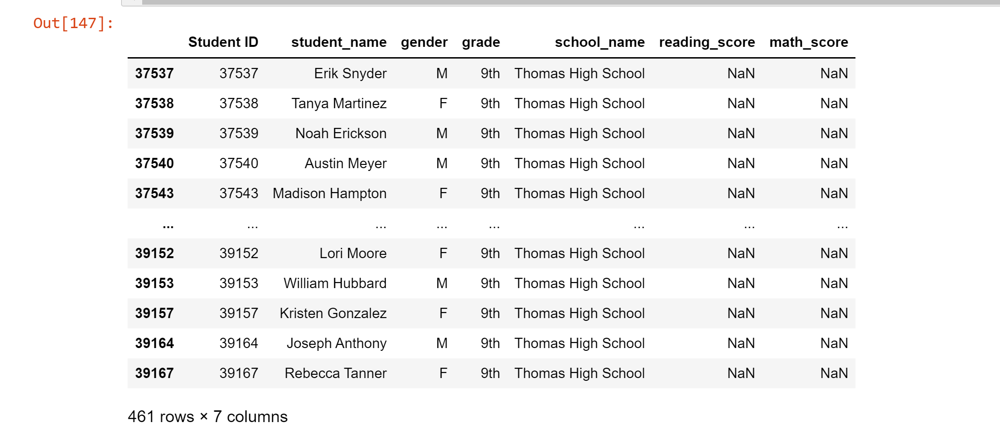

Before(see below)
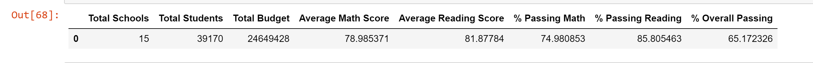

After(see below)
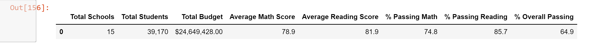

### How is the school summary affected?
The two pics below pretty much show they cheated, Math(93 to 66), Reading(97 to 69) and overall(91 to 65) changed pretty significantly.

Before(see below)
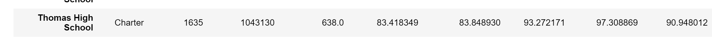

After(see below)
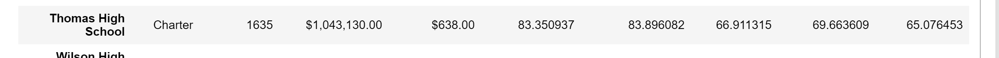

### How does replacing the ninth graders’ math and reading scores affect Thomas High School’s performance relative to the other schools?
Thomas goes from 2nd at 90.948012 to 8th at 65.076453, this is a significant change.  See below

Before(see below)
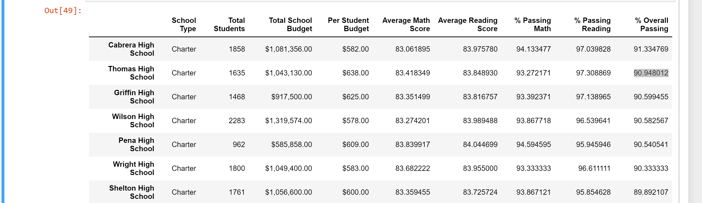

After(see below)
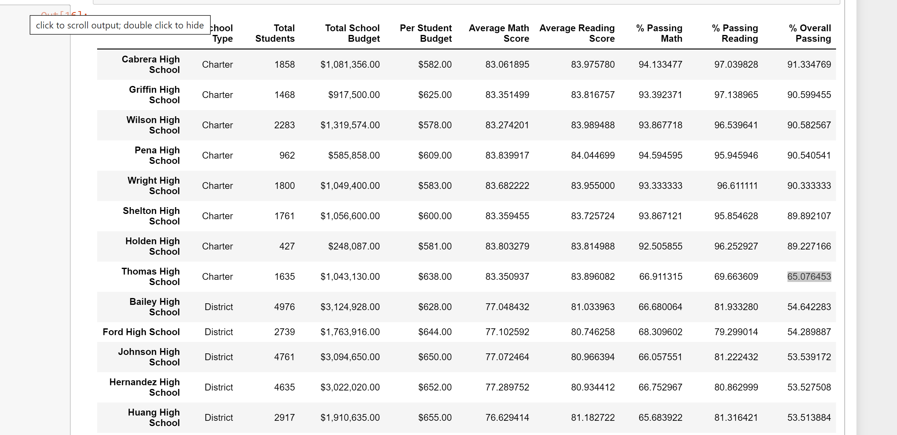

### How does replacing the ninth-grade scores affect the following:
#### Math and reading scores by grade 
It changes the Math and Reading by grade in that now both Have Nan, prior they did not for 9th grade Thomas High School(See below).

Math Before
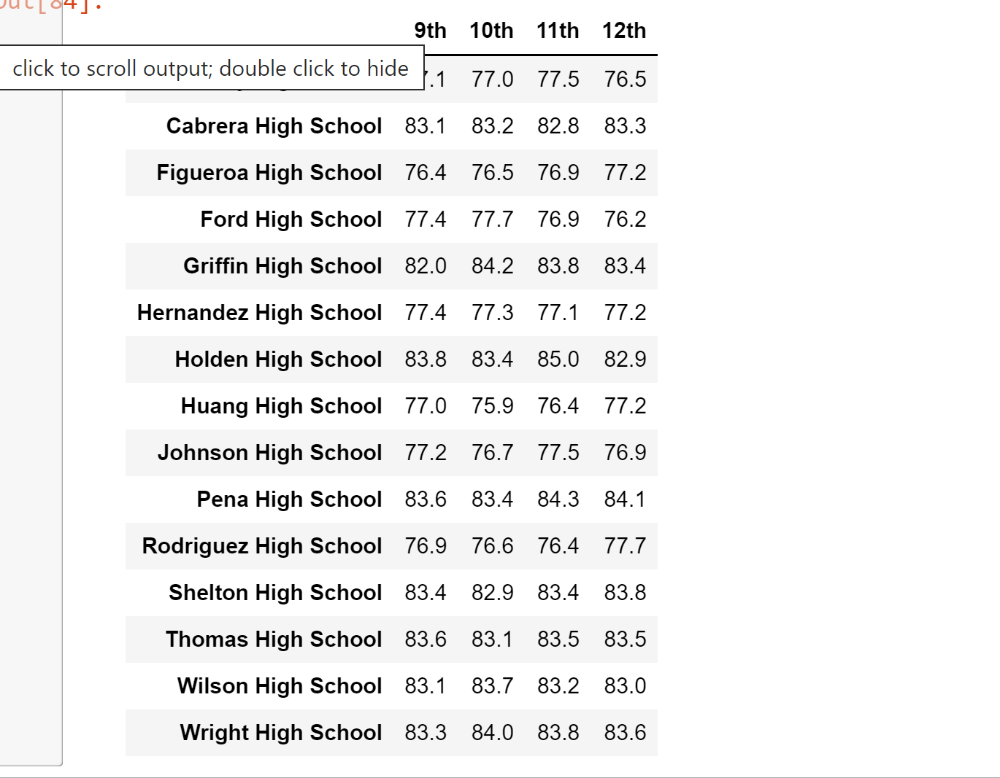

Math After
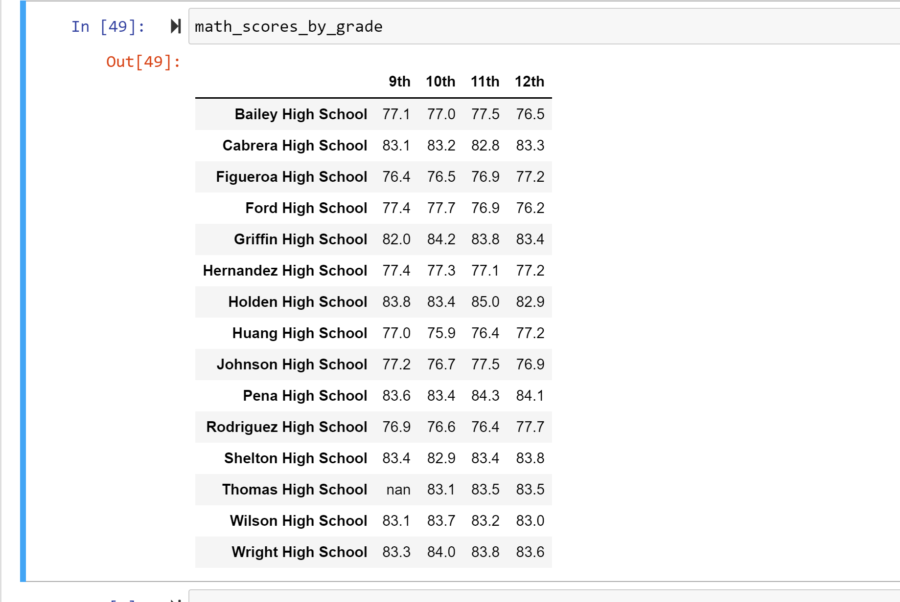

Reading Before
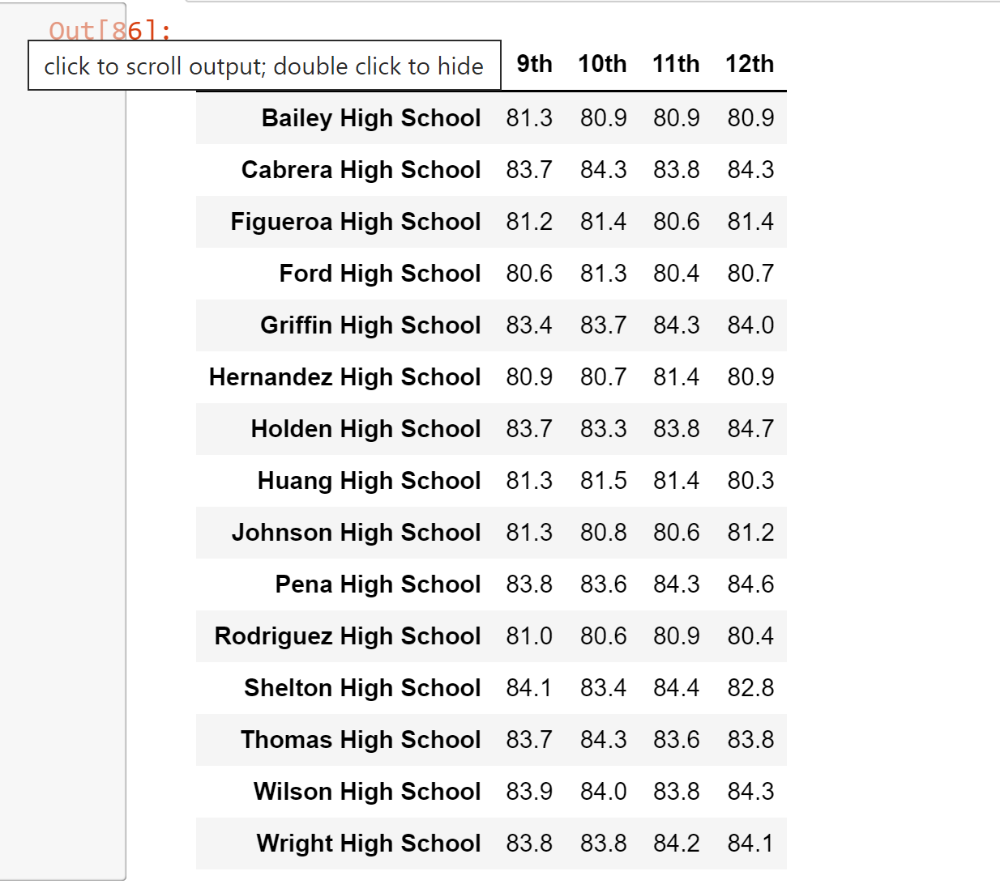

Reading After
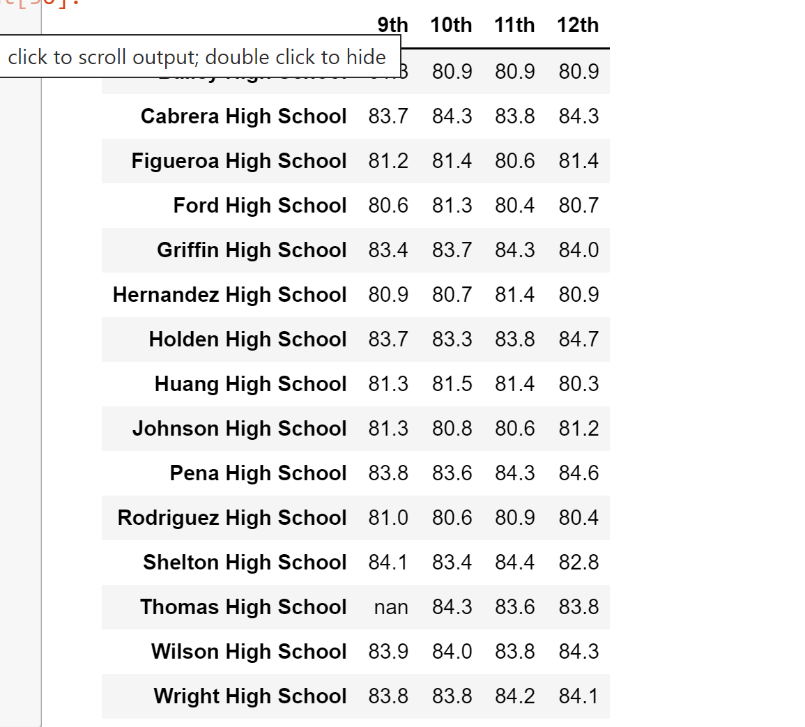

#### Scores by school spending 
I didnt not see any significant changes, I probably could have gotten the decimal lower to show some difference, but I dont think it would be of much value.

Spending Before

Spending After

#### Scores by school size - 
Once again, I didnt not see any significant changes, I probably could have gotten the decimal lower to show some difference, but I dont think it would be of much value.

Size Before
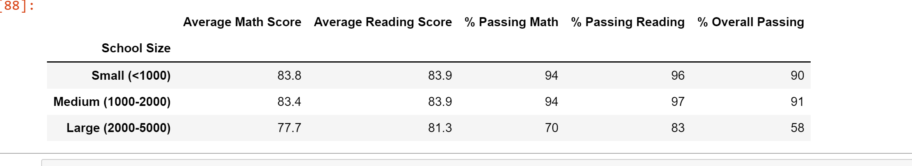

Size After
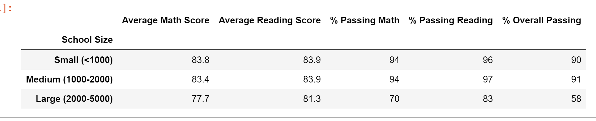

#### Scores by school type - 
Once again, I didnt not see any significant changes, I probably could have gotten the decimal lower to show some difference, but I dont think it would be of much value.

Size Before
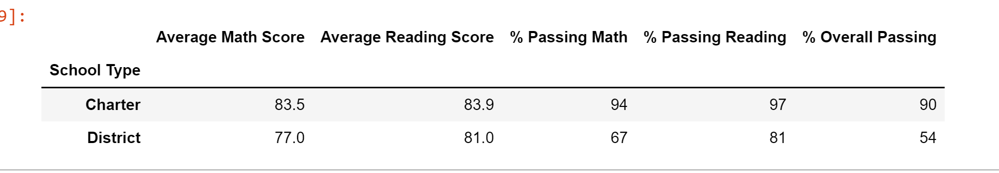

Size After

## Summary
There were some significant changes % Passing Math went from 93.27 to 66.91, % Passing Reading from 97.30 to 69.66, % Overall Passing from 90.94 to 65.07. 
Also Thomas High School dropped in ranking from 2nd to 8th.  Finally for math and reading at the grade level is now Nan for Thomas High School 9th graders.
